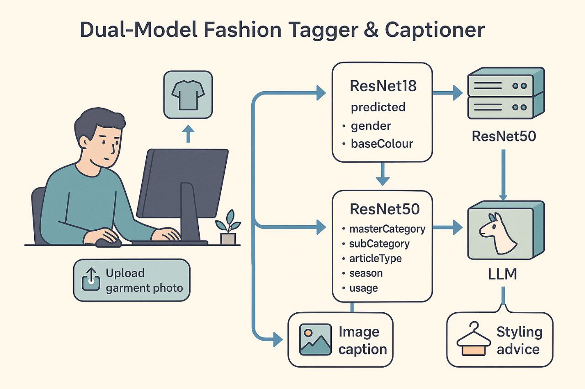

# Fashion Multi-Task Tagging & Stylist App
A compact project that trains multi-task classification models on a fashion dataset and serves predictions via a Streamlit web app.

## 📖 Table of Contents

- [Dataset](#-dataset)
- [Features](#-features)
- [Evaluation Results & Model Rationale](#-evaluation-results--model-rationale)
- [Architecture](#-architecture)
- [Installation](#-installation)
- [Running the App](#-running-the-app)


---

## 📊 Dataset

A brief overview of the fashion dataset used for training:

- **Source & Format**: Data originates from a curated `styles.csv` metadata file containing image filenames and 7 attribute columns: `gender`, `masterCategory`, `subCategory`, `articleType`, `baseColour`, `season`, and `usage`.
- **Size**: \~44,000 images stored under `data/images/`, each linked via an `image` column in the CSV.
- **Preprocessing Steps**:
  1. Removed classes with fewer than 50 samples to reduce noise.
  2. Normalized label distributions by merging rarely-used categories under "Other".
  3. Resized images to a uniform target size (`TARGET_SIZE`) and applied standard normalization (`MEAN`, `STD`).

This dataset powers our multi-task models, ensuring balanced learning across all 7 fashion attributes.

## 🚀 Features

- **Data Preprocessing & EDA**: Cleans and visualizes `styles.csv`, removes noisy categories, merges and normalizes labels.
- **Multi-Task Learning**: Implements three PyTorch models (ResNet50, MobileNetV2, ResNet18) with shared backbones and separate classification heads for Mentioned 7 attributes
- **Training & Evaluation**: Splits data (80/20), applies transforms, tracks per-task and total loss, and prints classification reports with weighted F1.
- **Streamlit Front-End**: Upload an image, get predicted attributes with confidences, ask styling questions via LLM, or generate short captions.

---
## 📈 Evaluation Results & Model Rationale

### 📊 Performance Overview

After training, both ResNet variants were evaluated on the held-out 20% test split, reporting weighted F1-scores per attribute:

| Attribute      | ResNet18 F1 | ResNet50 F1 |
| -------------- | ----------- | ----------- |
| gender         | 0.92        | 0.88        |
| masterCategory | 0.88        | 0.90        |
| subCategory    | 0.75        | 0.78        |
| articleType    | 0.70        | 0.74        |
| baseColour     | 0.85        | 0.80        |
| season         | 0.79        | 0.81        |
| usage          | 0.76        | 0.80        |
| **Average**    | **0.82**    | **0.82**    |

### 🧠 Model Choice & Task Allocation

Based on these results, we adapted our backbone-task assignment:

1. **ResNet18 excels on coarse attributes**

   - Demonstrated higher F1 on `gender` (0.92 vs. 0.88) and `baseColour` (0.85 vs. 0.80), indicating its capacity is sufficient to learn broad distinctions without overfitting.
   - However, on fine-grained tasks like (`subCategory`, `articleType`), performance dips (0.75 and 0.70), suggesting under-capacity.

2. **ResNet50 for detailed attributes**

   - Delivers stronger results on complex labels like (`subCategory`, `articleType`, `usage`), where deeper representations capture nuanced patterns.
   - Yet slightly underperforms ResNet18 on broad tasks like `gender` and `baseColour`, hinting that its depth may introduce unnecessary complexity for easier distinctions.

3. **Balancing Overfitting & Capacity**

   - By assigning `gender` and `baseColour` to ResNet18, we leverage its robustness on coarse labels and avoid ResNet50’s over-parameterization for these tasks.
   - The remaining four attributes, which require richer feature extraction, are routed through ResNet50 to maximize accuracy without overfitting.

### 🧠 Model Choice & Task Allocation

1. **Why ResNet18 & ResNet50?**

   - **ResNet18** is lightweight, fast to train and infer, with fewer parameters—ideal for simpler attributes (e.g. `gender`, `masterCategory`) where overcapacity risks overfitting.
   - **ResNet50** offers deeper feature extraction, capturing finer details—beneficial for complex or high-cardinality labels (`subCategory`, `articleType`, `baseColour`, `season`, `usage`).

2. **Separate Heads by Label Complexity**

   - We partitioned the 7 tasks into two groups based on label count and visual complexity:
     - **Group A (ResNet18)**: `gender` (5 classes), `masterCategory` (4 classes),
     - **Group B (ResNet50)**: `subCategory` (47 classes), `articleType` (40 classes), `baseColour` (14 classes), `season` (4 classes) `usage` (4 classes)
   - This split balances computational load: lightweight backbone handles coarse-grained tags, while the deeper network focuses on fine-grained distinctions.

---

## 🏛️ Architecture

Below is an overview of the app’s architecture.:



This diagram illustrates the flow from image upload in Streamlit to prediction engines (ResNet18 & ResNet50) and LLM-powered styling module.

---

## ⚙️ Installation

1. Clone the repo:
   ```bash
   git clone https://github.com/aminnademi/Predict-Fashion-Product-Images.git
   cd Predict-Fashion-Product-Images
   ```
2. Install dependencies:
   ```bash
   pip install -r requirements.txt
   ```
3. You can download or load the dataset from  https://www.kaggle.com/datasets/paramaggarwal/fashion-product-images-small and place images them in observed variables.

---

## 🚀 Running the App

1. Place model files (`.pth`) and `label2idx.json` alongside `app.py` .
2. Set your Groq API key (you can create it on https://console.groq.com/keys for free) xin `app.py`:
   ```python
   API_KEY = "your_api_key"
   ```
3. Launch Streamlit:
   ```bash
   streamlit run app.py
   ```
4. In the browser:
   - Upload a clothing image
   - View predicted attributes & confidences
   - Ask styling questions (powered by LLM)
   - Generate short fashion captions

---